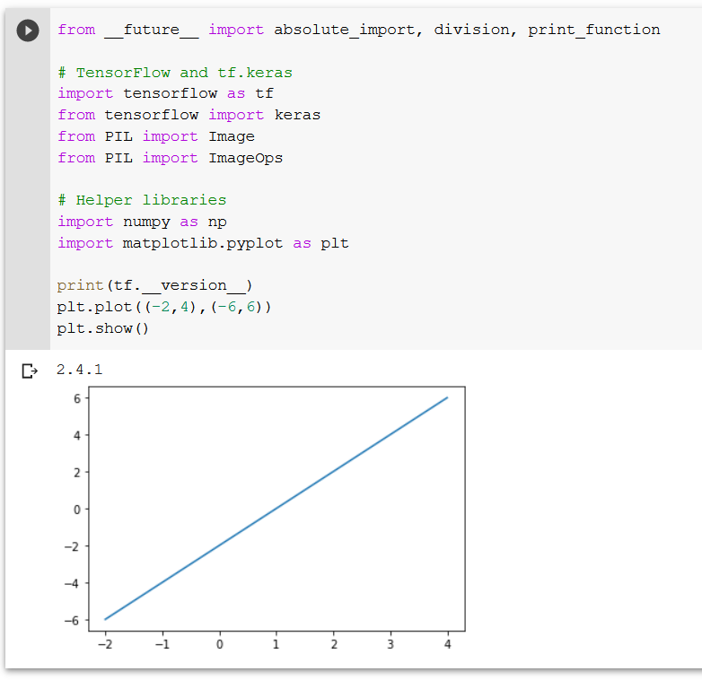

## Part 1

Screenshot of working tensorflow:

## Part 2

Screenshot of images 9000-9015

## Part 3

I was using google colab for this and was having issues getting my uploaded files
to work properly. However, I do feel like I understand the process and tinkered
a bit with the code to get a better understanding of it.
