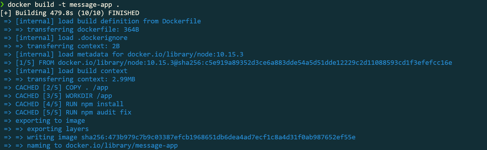
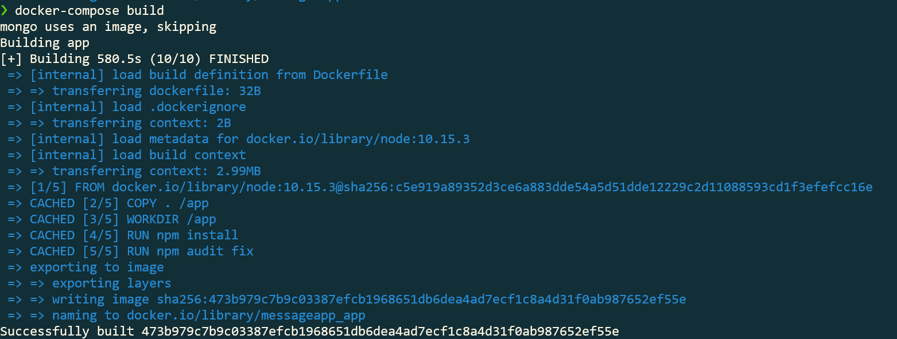
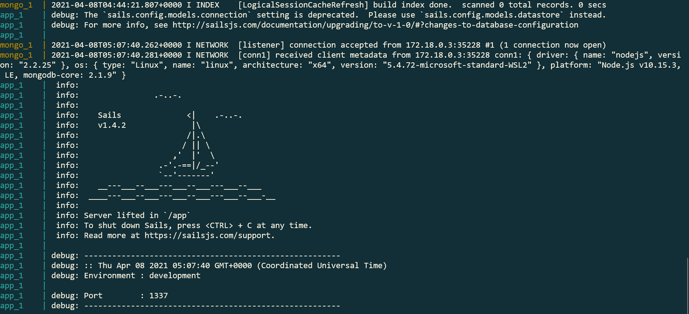

## Example 0

Running docker test from example 0:

## Example 1

Running cowsay from inside ubuntu docker container:

## Example 2

Rocketchat running, shown both container and image:

## Example 3

Hello world running in my terminal and in my browser:

## Example 4

Output from `docker build -t message-app .`

Output from `docker-compose build`

Output from `docker-compose up` running properly

