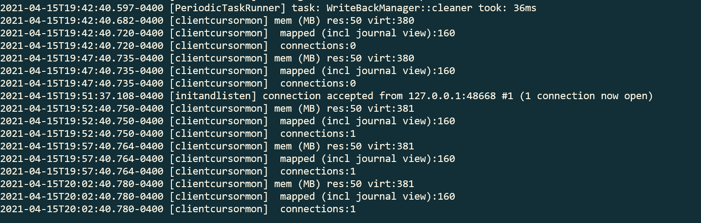
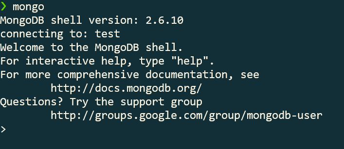
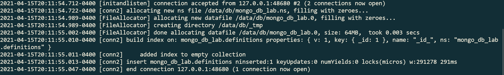
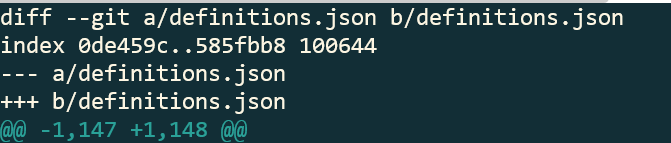
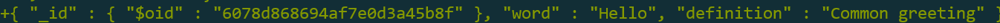
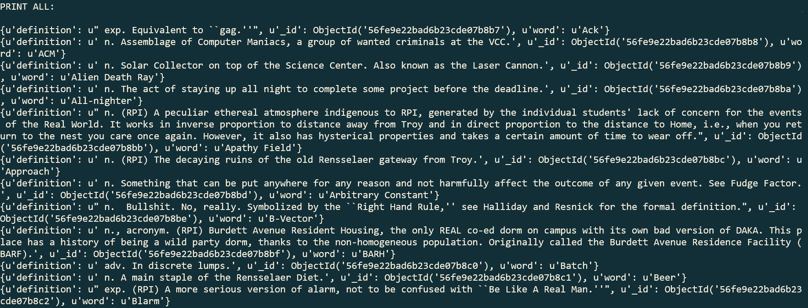
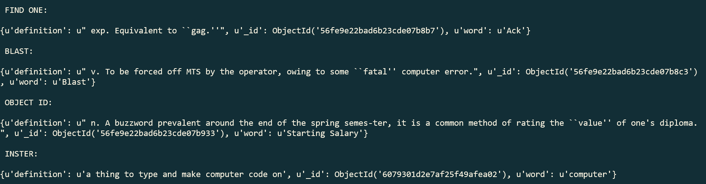
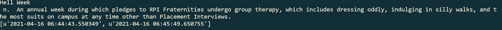
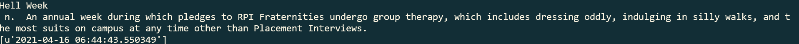

# Part 0

# Part 1

#### `mongod`:

#### `mongo`:

# Part 2

#### After `mongoimport --host=127.0.0.1 --db mongo_db_lab --collection definitions --file definitions.json`:

# Part 3

`db.definitions.find()` returned all of the definitions

`db.definitions.findOne()` returned a single definition

`db.definitions.find({word: "Capitaland"})` returned the definition of Capitaland

`db.definitions.find({_id: ObjectId("56fe9e22bad6b23cde07b8ce")})` returned the definition of Price Chopper

#### `git diff`

#### For some reason it showed up as -1,147 and +1,148 after adding the below definition:

# Part 4

#### Print all records (I didn't include them all, it goes on for a while)

#### Find one, find specific one, find by object id, and an insert one

#### Link to [script](https://github.com/BreadGarLick/mongodb_lab/blob/master/checkpoint4.py)

# Part 5

#### Hell Week appearing twice:

#### Link to [script](https://github.com/BreadGarLick/mongodb_lab/blob/master/checkpoint5.py)
